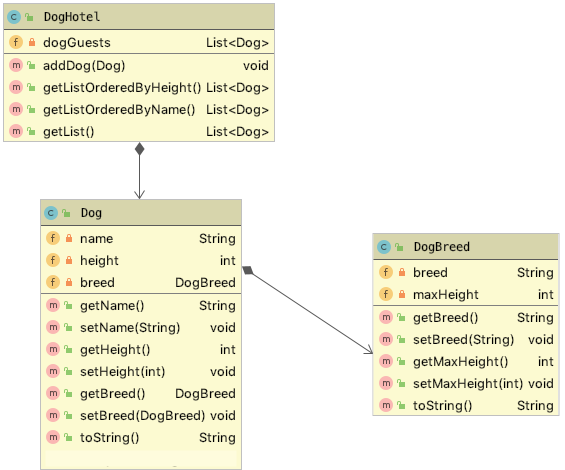

# Übung DogHotel

- Vergleichen und sortieren von Listen

## Ausgangssituation

Für ein Hundehotel ist eine einfache Verwaltung der Hundegäste zu
erstellen. Im Hundehotel (DogHotel) sind mehrere Hunde (Dog)
untergebracht, die unterschiedlichen Hunderassen (DogBreed) angehören.

## Aufgabenstellung

- Erstellen Sie folgende Klassen:

1

- Erweitern Sie diese Klassen so, dass die bereits existierenden
  Unittests funktionieren. 
  
- Implementieren Sie eine natürliche Sortierung, mittels derer die
  Methode `getListOrderedByName` die Liste nach Namen geordnet
  zurückgibt.
  
- Implementieren Sie eine weitere Sortierung, mittels derer die Methode
  `getListOrderedByHeight` die Liste nach der Größe der Tiere (height)
  zurückgibt.
  
  
Viel Erfolg!